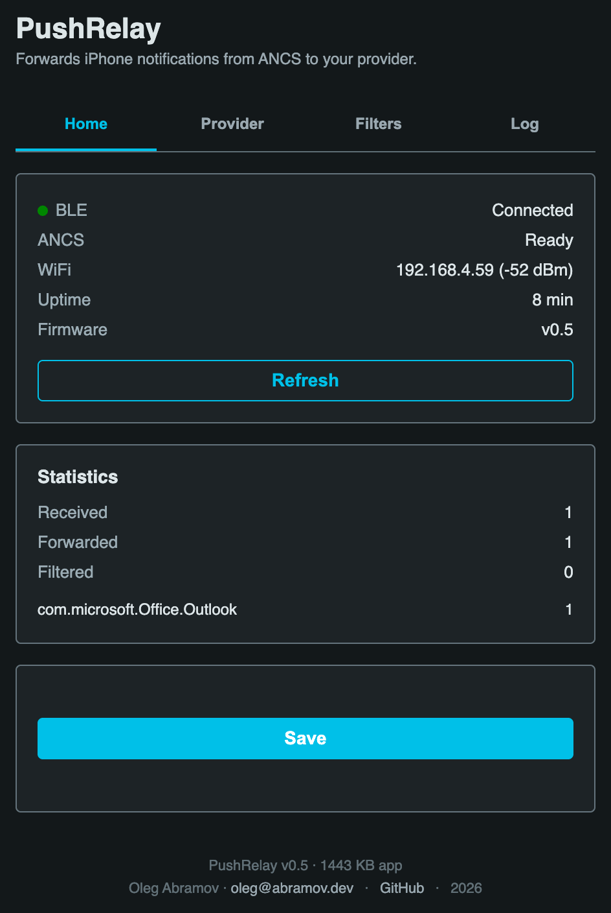

# PushRelay

> **📖 [maxlazar.github.io/PushRelay](https://maxlazar.github.io/PushRelay/)** —
> project documentation and a browser-based flasher that sends the latest
> firmware straight to your ESP32 over USB (Web Serial, no toolchain needed).

PushRelay is ESP32 firmware that connects to an iPhone as a BLE peripheral
(the same way a smartwatch does), intercepts notifications via **ANCS** (Apple
Notification Center Service), and forwards them — app name, title, body — to a
delivery provider: **Bark**, **Pushover**, or an **MQTT** broker.

> **Terminology:** the web admin UI labels this feature "Notification Center" —
> Apple's own consumer-facing name for what it's actually relaying. This README
> keeps using **ANCS** (Apple Notification Center *Service*) when talking about
> the underlying BLE protocol/implementation, since that's the precise term.

**Feature-complete:** WiFi setup, ANCS interception, a tabbed web admin UI,
watchdog/auto-restart, LED status, deduplication, OTA updates, app-allowlist
filtering, a Do Not Disturb schedule, per-app priority mapping, in-memory
stats, a recent-notifications log, multi-recipient delivery, and all three
delivery providers (Bark, Pushover, MQTT) working end to end. See [Known
limitations](#known-limitations) for open, non-blocking issues.

## Hardware

- ESP32-DevKitC-VE (ESP32-WROVER-E, 8 MB Flash, 8 MB PSRAM)
- USB cable for the initial flash — OTA works for every flash after that
- An iPhone. **Note:** ANCS appears to be iOS-only in practice — extensive
  testing found no evidence macOS exposes the ANCS service to third-party BLE
  accessories at all, despite pairing/bonding succeeding cleanly. If you only
  have a Mac, pairing will complete but no notifications will ever arrive; use
  an iPhone instead.

## Install (web flasher)

The quickest way to get firmware onto a device — **nothing to install on your
computer.**

1. Plug the ESP32 into your computer with a USB cable.
2. Open **<https://maxlazar.github.io/PushRelay/>** in **Chrome or Edge on a
   desktop** (Web Serial isn't available in Firefox or Safari, or on mobile).
3. Click **Connect**, pick the serial port (shows up as `CP2102` /
   `USB Serial`, or `COMx` on Windows), then **Install PushRelay** and confirm
   the erase prompt. Flashing takes about a minute.
4. When prompted, enter your Wi-Fi network and password. The firmware
   implements [Improv Serial](https://www.improv-wifi.com/serial/), so the
   flasher provisions Wi-Fi over the USB cable and then shows a clickable
   **Visit device** link straight to the device's IP
   (`http://192.168.x.x`) — that's the admin UI.
5. If the flasher doesn't offer Wi-Fi setup, the device falls back to the
   `PushRelay-Setup` captive portal instead — see
   [First boot — WiFi setup](#first-boot--wifi-setup).

A brand-new, never-flashed ESP32 works fine: the chip's built-in ROM bootloader
handles the first flash. If **Connect** finds no port, install the
[CP210x USB-UART driver](https://www.silabs.com/developer-tools/usb-to-uart-bridge-vcp-drivers)
(rarely needed on current Windows/macOS/Linux).

To read the device's IP off the cable at any time: keep it connected, click
**Logs & Console** on the flasher page, press the board's `EN`/`RST` button,
and watch for `[Main] WiFi connected: 192.168.…`.

The flasher page and firmware images are built and published automatically by
the [`Web Flasher` GitHub Action](.github/workflows/flasher.yml) on every
firmware-affecting push to `main`, which also cuts a versioned GitHub Release
(see [Releases & versioning](#releases--versioning)).

After the first flash, all further updates go [over the air](#updating-firmware) —
no cable needed. End users can update straight from the admin UI; there's
nothing else to install.

## Requirements (building from source)

Only needed if you want to build the firmware yourself instead of using the
[web flasher](#install-web-flasher) above.

- [PlatformIO](https://platformio.org/) — either the VS Code extension or the `pio` CLI
- An iPhone to pair with (source of notifications)
- Whichever delivery provider you plan to use: the [Bark app](https://apps.apple.com/app/bark-customed-notifications/id1403753865),
  a [Pushover](https://pushover.net) account, or an MQTT broker

## Project layout

```
push-relay/
├── src/main.cpp        # entry point: wiring for WiFi, ANCS, notifiers, web admin
├── include/
│   ├── config.h        # static config, committed to git
│   ├── secrets.h        # API keys, WiFi fallback — gitignored, not committed
│   ├── secrets.h.example
│   ├── notifiers.h      # notifier interface + Bark/Pushover/MQTT implementations
│   ├── ancs.h            # ANCS BLE peripheral + GATT client handler (NimBLE), UID dedup
│   ├── webadmin.h        # web admin UI (ESPAsyncWebServer + NVS config)
│   ├── led.h              # non-blocking onboard LED status patterns
│   ├── stats.h            # in-memory notification statistics
│   ├── notiflog.h         # in-memory ring buffer of the last 20 notifications
│   └── version.h
├── data/
│   └── index.html        # web admin page, uploaded to LittleFS
└── platformio.ini
```

## Firmware size

Current build, on the ESP32-WROVER-E's 8 MB flash / 8 MB PSRAM (numbers from
`pio run`, will drift slightly as the code changes):

| | Used | Partition | % |
|---|---|---|---|
| Firmware (flash) | ~1.47 MB | 3.19 MB (one OTA app slot, `default_8MB.csv`) | ~44% |
| RAM (heap, static) | ~62 KB | 320 KB | ~19% |
| LittleFS data (`data/index.html`) | ~27 KB | 1.5 MB (`spiffs` partition) | ~2% |

There's plenty of headroom on this hardware in every dimension — flash usage
dropped noticeably (from ~2 MB to ~1.47 MB) after switching the BLE stack
from the classic "ESP32 BLE Arduino" (Bluedroid) library to NimBLE-Arduino,
which is also lighter-weight at runtime.

## First-time setup (from source)

Skip this if you flashed with the [web flasher](#install-web-flasher) — pick up
at [First boot — WiFi setup](#first-boot--wifi-setup).

1. **Clone and configure secrets**

   ```bash
   cp include/secrets.h.example include/secrets.h
   ```

   Fill in `include/secrets.h` with your provider credentials. This file is
   gitignored — it never gets committed. These values are only a *fallback*;
   once the device is running you can also set the active provider and its
   credentials from the web admin UI, which is stored in NVS and survives
   reboots.

   Also set `OTA_PASSWORD` in `secrets.h` — it protects OTA firmware uploads over
   WiFi (see [Updating firmware](#updating-firmware)).

2. **Build and upload the filesystem image** (the web admin page in `data/`)

   ```bash
   pio run --target uploadfs
   ```

3. **Build and flash the firmware**

   ```bash
   pio run --target upload
   ```

4. **Open the serial monitor** (optional, useful for the first run)

   ```bash
   pio device monitor
   ```

## First boot — WiFi setup

On first boot (or whenever saved WiFi credentials fail), the ESP32 opens a
captive-portal hotspot named **`PushRelay-Setup`**:

1. On your phone/laptop, connect to the `PushRelay-Setup` WiFi network.
2. A captive portal should open automatically (or browse to `192.168.4.1`).
3. Pick your WiFi network and enter its password.
4. The ESP32 saves the credentials to flash and reboots onto your network.

You will not need to reflash the device to change WiFi networks later — just
reset it and repeat this flow (WiFiManager falls back to the portal whenever it
can't connect with stored credentials).

Once connected, the device is reachable at **http://pushrelay.local** from any
device on the same network (mDNS/Bonjour). If mDNS doesn't resolve on your
network, use the device's IP directly (visible in the serial log, or your
router's client list).

## Pairing with your iPhone (ANCS)

1. On your iPhone, go to **Settings → Bluetooth**.
2. PushRelay should appear as a nearby device (advertised as `PushRelay`). Tap to connect.
3. iOS will show a pairing dialog — accept it. Since PushRelay requests an
   **authenticated** bond (see note below), you may see a passkey/numeric
   confirmation step; just accept it (PushRelay auto-confirms on its side
   regardless, since it has no display to show a real code).
4. Once paired, the device stays bonded across reboots; ANCS notifications start
   flowing automatically to whichever provider is configured.

> **Why an authenticated bond matters:** ANCS's characteristics are documented
> as requiring "authorization for access." In practice this means the link
> must be authenticated (MITM-protected), not merely encrypted — a plain
> "Just Works" pairing lets the GATT subscription succeed *silently* while the
> phone never actually sends any notification data. This was a real, painful
> bug found during development: everything looked correct (bonded, subscribed,
> no errors) and notifications simply never arrived. If you're modifying this
> firmware, don't "simplify" the security setup back to `BLE_SM_IO_CAP_NO_IO` —
> it will look like it works and then silently deliver nothing.

> **If Settings never lists PushRelay at all:** some iOS/macOS versions simply
> don't surface generic BLE accessories in the Bluetooth settings screen —
> that's a platform limitation, not a firmware bug. Use a generic BLE scanner
> app (e.g. **LightBlue**, free) to connect to `PushRelay` once instead; that
> alone triggers the same system pairing dialog. This is a **one-time
> bootstrap step** — once bonded, the device reconnects automatically from
> then on and (usually) shows up under Settings → Bluetooth → My Devices like
> any other paired accessory.

## LED status

The onboard LED (GPIO2) reports state at a glance:

| Pattern | Meaning |
|---|---|
| Slow blink (1s) | Connecting — waiting for BLE pairing |
| Solid on | BLE connected and ANCS ready |
| Fast blink (200ms) | Error — WiFi lost |
| Quick double-blink overlay | A notification was just forwarded successfully — plays over whatever the base pattern is, then resumes it |
| Double blink | A notification was just forwarded successfully |

## Reliability

- **Watchdog:** a 5-minute ESP-IDF task watchdog reboots the device if the main
  loop ever hangs.
- **BLE auto-recovery:** independently of the watchdog, if the BLE link to the
  phone stays disconnected for more than 5 minutes, the device reboots to force
  a fresh advertise/pair cycle.
- **Deduplication:** ANCS can redeliver the same notification (e.g. on
  reconnect) — the last 10 notification UIDs are tracked in memory and repeats
  are dropped silently.
- **Backlog suppression:** on every (re)connect, ANCS resends "Added" events
  for *every* notification still sitting in the phone's Notification Center,
  not just new ones — without this, a reconnect would re-forward the entire
  backlog (old calendar reminders, days-old messages, etc.). Two layers filter
  this out (configurable — see [Backlog filtering](#backlog-filtering)):
  - Notifications arriving within 15 seconds of ANCS becoming ready are
    treated as backlog and dropped silently — this catches the immediate
    burst most reconnects produce.
  - Slower-trickling backlog is caught with an actual age check against
    ANCS's own `Date` attribute. That attribute is the phone's *local* time,
    not UTC, so it needs a UTC-offset correction first — either a manual
    "Phone timezone offset" setting in the admin UI, or auto-calibration from
    live traffic (two notifications agreeing on the same offset, quantized to
    the nearest 15 minutes, before it's trusted — a single sample could
    itself be backlog and calibrate against the wrong value). Until an offset
    is known, this layer is a no-op and only the timing window above applies.
- **WiFi/BLE radio coexistence:** the ESP32 has a single 2.4GHz radio shared
  by WiFi and Bluetooth. The firmware explicitly prioritizes Bluetooth's radio
  time (`esp_coex_preference_set(ESP_COEX_PREFER_BT)`) since ANCS is the
  device's actual purpose.

## Web admin UI



Open **http://pushrelay.local** in any browser (mobile Safari/Chrome included, no
app required). The page is split into four tabs:

- **Home** — live status (BLE/ANCS connection, WiFi signal, uptime, firmware
  version — tap **Refresh** to update, see the stability note below), the
  **Firmware update** card (see [Updating firmware](#updating-firmware)), and
  the **Statistics** card
- **Provider** — the default delivery provider (Bark / Pushover / MQTT) and
  its credentials, **Recipients** for fanning out to more than one
  destination, and **Message format** for customizing the forwarded text (see
  [Message format](#message-format))
- **Filters** — app allowlist filtering, Do Not Disturb, per-app priority, and
  [Backlog filtering](#backlog-filtering)
- **Log** — the last 20 notifications ANCS delivered, with full detail (see
  [Notification log](#notification-log))

**Save** persists everything from the Provider and Filters tabs to NVS in one
request, regardless of which tab is currently open.

> **Known issue:** under sustained load (the admin page open with frequent
> polling, combined with active BLE traffic), the ESP32's TCP stack can be
> pushed into a bad state and crash-reboot the whole device. This is
> mitigated — the admin page uses a manual **Refresh** button instead of
> auto-polling — but not fully root-caused. It does not affect the core ANCS →
> provider delivery pipeline, which runs independently of the web server. If
> you hit this, avoid leaving the admin page open continuously and prefer
> checking `/api/stats` sparingly.

## Configuring Bark

1. Install the [Bark app](https://apps.apple.com/app/bark-customed-notifications/id1403753865) on an iOS device that should *receive* forwarded notifications.
2. Copy the **device key** shown in the app (or use your own self-hosted Bark server's key).
3. Paste it into the **Bark device key** field in the PushRelay admin UI and save.

> **Common mistake:** Bark distinguishes a per-device **device key** (what you
> paste into an app URL to push to that device) from a **server key** (used to
> administer a self-hosted Bark server). Pasting a server key here will fail
> with an HTTP 400 and a `"failed to get device token"` error from Bark's API
> — make sure you're copying the device key from the app itself.

## Configuring Pushover

1. Create a [Pushover](https://pushover.net) account and an "Application" — this gives you an **app token**.
2. Find your **user key** on your Pushover dashboard.
3. Paste both into the **Pushover app token** / **Pushover user key** fields (either as the default provider, or as a Recipient) and save.

Per-app priority rules map to Pushover's `priority` parameter: `critical` → `2`
(emergency, with `retry=60&expire=3600` so it re-alerts until acknowledged),
`high` → `1`, `low` → `-1`, unset → `0`.

## Configuring MQTT

1. Set the **broker host**, **port** (1883 plain, 8883 typical for TLS), and
   **topic** in the admin UI's MQTT fields (select MQTT as the default provider).
2. Optionally set a username/password, and toggle **Use TLS** if your broker requires it.
3. Save. Each notification is published as a JSON object:

   ```json
   {"app": "WhatsApp", "title": "Jane Doe", "body": "On my way", "priority": "high"}
   ```

MQTT is only available as the single default provider, not as a per-recipient
option — a per-recipient broker/topic didn't fit the simpler recipient model,
and one global broker covers the realistic use case.

## Updating firmware

**From the admin UI** (no computer at all) — the normal path for end users. The
**Home** tab has a **Firmware update** card:

1. Click **Check for updates**. The device fetches
   [`update.json`](https://maxlazar.github.io/PushRelay/update.json) from
   GitHub Pages and compares its version with the running firmware. (The web
   flasher uses a separate `install.json` — different schema, same directory.)
2. If a newer version is published, click **Install v*x.y.z***. The device
   streams the new firmware (and the admin-page filesystem image) straight
   into its spare OTA slot, verifies each against the SHA-256 in the manifest,
   and reboots. Notification forwarding pauses for up to a minute during the
   download.

Integrity is guaranteed by the manifest SHA-256, so the transfer uses a plain
TLS connection with no pinned certificate. A bad or interrupted download is
rejected before it is committed and leaves the running firmware untouched.

**Over the air with `pio`** (no cable, but needs a computer with PlatformIO) —
the developer path:

```bash
pio run --target upload --upload-port pushrelay.local \
  --upload-flags "--auth=<your OTA_PASSWORD>"
```

Or, from PlatformIO's VS Code extension, pick the `pushrelay.local` network
device from the upload-port list. Firmware version and free heap are visible at
`GET /api/ota-status` for confirming an update landed.

**Over USB** (needed for the very first flash, or as a fallback):

```bash
pio run --target upload
```

> Reflashing firmware/filesystem does **not** erase your saved WiFi
> credentials or NVS config (provider keys, filters, etc.) — those live in a
> separate NVS partition. A full `pio run --target erase` (or `esptool.py
> erase_flash`) wipes everything, including BLE bond data, and will require
> re-pairing from scratch.

## Releases & versioning

Every push to `main` that touches firmware/filesystem sources
(`src/`, `include/`, `data/`, `platformio.ini`, `version.txt`, `scripts/`)
runs the [`Web Flasher` workflow](.github/workflows/flasher.yml), which:

- rebuilds the Pages site + web flasher,
- publishes `firmware.bin`, `littlefs.bin` and `update.json` to GitHub Pages
  (this is what the admin-UI updater reads; also mirrored to `manifest.json`
  for devices on older firmware), and
- creates a `v*x.y.z*` GitHub Release with the same files attached as an
  immutable archive.

Doc-only pushes redeploy Pages but do not cut a release.

**Version numbers are `MAJOR.MINOR.PATCH`:**

- `MAJOR.MINOR` live in [`version.txt`](version.txt) and are bumped by hand.
- `PATCH` is computed at build time by
  [`scripts/pio_version.py`](scripts/pio_version.py) as the number of commits
  since `version.txt` last changed — so it resets to `0` on every `MINOR` bump
  and is otherwise monotonic on a linear `main` history. CI also passes the
  same string through `PUSHRELAY_VERSION` so the firmware reports exactly the
  tag it was released under.

To ship a `MINOR`/`MAJOR` bump: edit `version.txt`, commit, push. The next
build is `x.y.0`.

## App filter

Enable **App filter** in the admin UI and list allowed app names (comma-separated,
case-insensitive, matched against the human-readable app name — e.g. `Teams,
WhatsApp, Telegram, Phone, Messages`). When enabled, notifications from any app
not on the list are dropped silently and counted under `notifications_filtered`.
Leaving the list empty while the toggle is on effectively disables filtering
(nothing to match against, so everything passes).

## Do Not Disturb

Enable **Do Not Disturb** and set a start/end hour window (0–23). Notifications
arriving inside the window are dropped silently. The device syncs time via NTP
(`pool.ntp.org`) with **no timezone offset**, so the hours you enter are in
**UTC** — convert your local DND window accordingly (e.g. 23:00–08:00 local in
UTC+2 is 21:00–06:00 UTC).

## Per-app priority

Add rows under **Per-app priority** mapping an app name to `critical` / `high` /
`low`. This is passed through to the delivery provider:

- **Bark:** `critical` → `level=critical`, `high` → `level=timeSensitive`,
  `low` → `level=passive`
- **Pushover:** `critical` → priority `2` (emergency, repeats until
  acknowledged), `high` → `1`, `low` → `-1`

Apps with no rule use the default level (`timeSensitive` on Bark, `0` on Pushover).

## Backlog filtering

On every (re)connect, ANCS resends "Added" events for *every* notification
still sitting in the phone's Notification Center, not just new ones — see
[Reliability](#reliability) for why this needs filtering at all. Most of it is
caught automatically by an arrival-timing window; the **Phone timezone
offset** field on the Filters tab lets you speed up the second layer, an
actual age check, which otherwise waits to auto-calibrate from live traffic:

- Pick your phone's UTC offset from the dropdown (covers the standard set of
  real-world timezone offsets, UTC-12:00 through UTC+14:00, including the
  half/quarter-hour ones) to activate the age check immediately.
- Leave it blank (the default) to auto-detect: once two notifications agree on
  the same offset, it's trusted and used from then on. Until then, only the
  timing window filters backlog.

The offset needs updating manually if you travel across timezones or clear it
back to blank to let auto-detection re-calibrate.

## Statistics

The admin UI's **Statistics** card and `GET /api/stats` show notifications
received/forwarded/filtered and the top apps by notification count, all
in-memory counters that reset on reboot:

```json
{
  "uptime_seconds": 3600,
  "notifications_received": 142,
  "notifications_forwarded": 98,
  "notifications_filtered": 44,
  "ble_connected": true,
  "wifi_rssi": -62,
  "top_apps": [{"app": "Teams", "count": 61}, {"app": "WhatsApp", "count": 37}]
}
```

## Notification log

The admin UI's **Log** tab and `GET /api/log` show the last 20 notifications
ANCS delivered to the device, most recent first, with full detail — app,
title, body, priority, and delivery outcome. It's an in-memory ring buffer
(resets on reboot, like Statistics), meant for spot-checking what's actually
arriving and where it went, not a persistent history:

```json
[
  {
    "app": "WhatsApp",
    "title": "Jane Doe",
    "body": "On my way",
    "uid": 142,
    "priority": "high",
    "status": "forwarded",
    "ageSeconds": 12
  }
]
```

`status` is one of `forwarded`, `failed` (a provider was configured but every
send attempt failed), `filtered_app` (blocked by the App filter), or
`filtered_dnd` (blocked by Do Not Disturb).

## Multiple recipients

Add rows under **Recipients** to fan a single notification out to more than one
destination (e.g. two Bark keys, or Bark + Pushover). If the list is empty,
PushRelay falls back to the single **Default provider** section above. Bark
and Pushover recipients both deliver; MQTT is default-provider-only (see
[Configuring MQTT](#configuring-mqtt)).

## Message format

By default each provider formats the forwarded message its own way (Bark uses
a title/body split, Pushover prefixes the title onto the message, MQTT sends
title and body as separate JSON fields). The **Message format** section on the
Provider tab lets you override the body text with a custom template instead,
built out of `{token}` placeholders:

| Token | Value |
| --- | --- |
| `{app}` | App name, e.g. `Teams` |
| `{title}` | Notification title (falls back to the app name if empty) |
| `{body}` | Notification body, trimmed to a 128-char preview |
| `{longBody}` | Full notification body, up to 1024 chars (ANCS may truncate longer) |
| `{date}` | Date the notification was forwarded, `YYYY-MM-DD` |
| `{time}` | Time the notification was forwarded, `HH:MM:SS` |
| `{datetime}` | `{date}` and `{time}` combined |
| `{priority}` | Resolved priority (`critical`/`high`/`low`/`default`) |
| `{sourceDate}` | Date the notification was originally created on the iPhone, `YYYY-MM-DD` |
| `{sourceTime}` | Time the notification was originally created on the iPhone, `HH:MM:SS` |
| `{sourceDatetime}` | `{sourceDate}` and `{sourceTime}` combined |

`{date}`/`{time}`/`{datetime}` reflect when PushRelay forwarded the message;
`{sourceDate}`/`{sourceTime}`/`{sourceDatetime}` come from ANCS's own `Date`
attribute — the phone's local time when the notification was created. The
source fields render empty if ANCS doesn't supply a date for a given
notification.

Click a token chip in the admin UI to insert it at the cursor. Leave the field
blank to keep each provider's default formatting.

## Troubleshooting

| Symptom | Likely cause |
|---|---|
| `PushRelay-Setup` hotspot doesn't appear | Device may already hold valid WiFi credentials — power-cycle and check serial log |
| `http://pushrelay.local` doesn't resolve | Some networks/OSes don't support mDNS well; try the device's IP from the serial log instead |
| iPhone doesn't offer notification sharing | Forget the device in iOS Bluetooth settings and re-pair; ensure the ESP32 is advertising (check serial log for `[ANCS] Advertising as...`) |
| Bonded and subscribed, but zero notifications ever arrive | Almost certainly a "Just Works" (non-authenticated) bond — see the note in [Pairing with your iPhone](#pairing-with-your-iphone-ancs). Forget the device and re-pair so it negotiates the authenticated bond fresh. |
| Bark returns HTTP 400 / `"failed to get device token"` | You've configured a Bark **server key** instead of a **device key** — see [Configuring Bark](#configuring-bark) |
| No notifications forwarded despite pairing | Check `/api/status` — `ancsReady` must be `true`; verify a provider is configured correctly and the device has WiFi |
| Device reboots every ~5 minutes | BLE link to the phone isn't recovering — check pairing, or that the phone is in range |
| Device randomly reboots with `assert failed` in the serial log | Known TCP-stack stress issue under heavy web-admin polling + active BLE — see the note in [Web admin UI](#web-admin-ui) |
| OTA upload rejected | Wrong `--auth` password, or it doesn't match `OTA_PASSWORD` in `secrets.h` |
| Notifications silently stop during certain hours | Check the **Do Not Disturb** window — remember it's UTC, not local time |
| Only some apps forward | Check **App filter** — if enabled, only apps on the allowlist are forwarded |
| Old/backlog notifications get forwarded after a reconnect | See [Backlog filtering](#backlog-filtering) — set the **Phone timezone offset** manually instead of waiting on auto-detection |
| Testing on a Mac, nothing ever arrives | ANCS appears not to be exposed to third-party accessories on macOS at all — use an iPhone instead |

## Known limitations

- Web admin UI can crash-reboot the device under sustained load (see
  [Web admin UI](#web-admin-ui)) — mitigated but not fully root-caused.
- No macOS support for ANCS delivery has been found despite BLE pairing
  working — treated as a platform limitation, not pursued further (see
  [Hardware](#hardware)).

---

_PushRelay v0.5 — Oleg Abramov (oleg@abramov.dev)_
